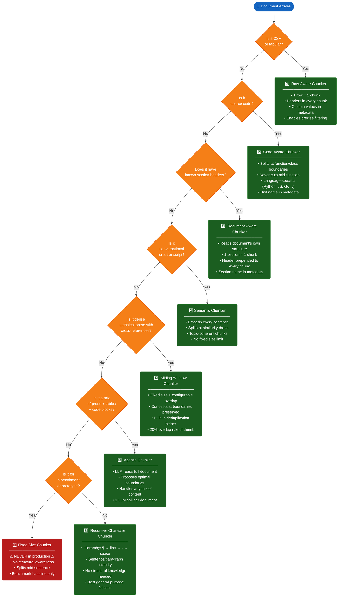
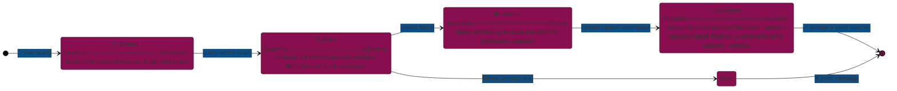
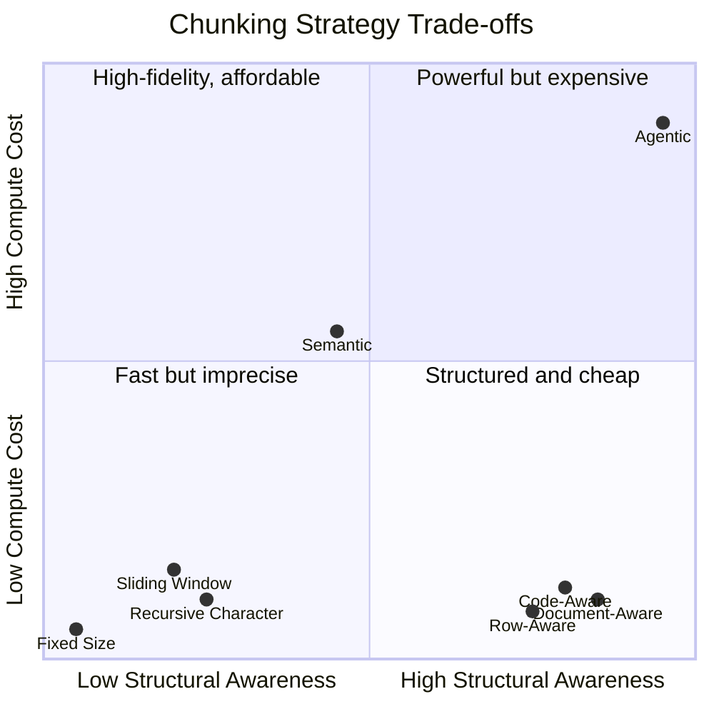

# Chunking Engine

> **Production-grade adaptive document chunking for RAG pipelines**
> Built with LangChain · LangGraph · Milvus · AWS Bedrock · Azure OpenAI

---

## The Golden Rule

> **There is NO single best chunking strategy. The right strategy depends entirely on the document type.**

This engine automatically selects the optimal strategy for each document and orchestrates an end-to-end RAG pipeline with observable, testable, provider-agnostic components.

---

## Architecture Overview

```mermaid
%%{init: {'theme': 'base', 'themeVariables': {
  'primaryColor': '#1a1a2e',
  'primaryTextColor': '#e0e0ff',
  'primaryBorderColor': '#4a4af4',
  'lineColor': '#7070ff',
  'secondaryColor': '#16213e',
  'tertiaryColor': '#0f3460'
}}}%%
graph TB
    classDef input      fill:#1565C0,stroke:#90CAF9,stroke-width:2px,color:#fff
    classDef ingestion  fill:#1B5E20,stroke:#A5D6A7,stroke-width:2px,color:#fff
    classDef chunker    fill:#4A148C,stroke:#CE93D8,stroke-width:2px,color:#fff
    classDef provider   fill:#E65100,stroke:#FFCC02,stroke-width:2px,color:#fff
    classDef vector     fill:#006064,stroke:#80DEEA,stroke-width:2px,color:#fff
    classDef retrieval  fill:#880E4F,stroke:#F48FB1,stroke-width:2px,color:#fff
    classDef api        fill:#33691E,stroke:#DCEDC8,stroke-width:2px,color:#fff

    subgraph INPUT["📄 Document Input Layer"]
        D1[Structured Document]:::input
        D2[General Text]:::input
        D3[Transcript]:::input
        D4[Source Code]:::input
        D5[Tabular Data]:::input
        D6[Technical Doc]:::input
        D7[Heterogeneous]:::input
    end

    subgraph INGESTION["⚙️  LangGraph Ingestion Pipeline"]
        N1["🔍 Classify Document"]:::ingestion
        N2["📋 Select Strategy"]:::ingestion
        N3["✂️  Execute Chunker"]:::ingestion
        N4["🔢 Generate Embeddings"]:::ingestion
        N5["💾 Index to Milvus"]:::ingestion
        N1 --> N2 --> N3 --> N4 --> N5
    end

    subgraph CHUNKERS["🧠 Chunking Strategy Engine"]
        C1["1️⃣  Fixed Size\n(benchmark only)"]:::chunker
        C2["2️⃣  Recursive Character\n(general text)"]:::chunker
        C3["3️⃣  Document-Aware\n(structured docs)"]:::chunker
        C4["4️⃣  Semantic\n(transcripts)"]:::chunker
        C5["5️⃣  Code-Aware\n(source files)"]:::chunker
        C6["6️⃣  Row-Aware\n(CSV/tables)"]:::chunker
        C7["7️⃣  Sliding Window\n(technical docs)"]:::chunker
        C8["8️⃣  Agentic\n(complex mixed)"]:::chunker
    end

    subgraph PROVIDERS["☁️  LLM Providers (plug-and-play)"]
        P1["🟠 AWS Bedrock\nClaude 3.5 Sonnet\nTitan Embed v2"]:::provider
        P2["🔵 Azure OpenAI\nGPT-4o\ntext-embedding-3-large"]:::provider
    end

    subgraph VECTOR["🗄️  Vector Database"]
        M1["⚡ Milvus\nHNSW Index\nCosine Similarity"]:::vector
    end

    subgraph RETRIEVAL["🔎 LangGraph Retrieval Pipeline"]
        R1["📝 Preprocess Query"]:::retrieval
        R2["🔢 Embed Query"]:::retrieval
        R3["🔍 ANN Search"]:::retrieval
        R4["📊 Rerank Results"]:::retrieval
        R5["💬 Generate Answer"]:::retrieval
        R1 --> R2 --> R3 --> R4 --> R5
    end

    subgraph API["🌐 REST API (FastAPI)"]
        A1["POST /api/v1/ingest"]:::api
        A2["POST /api/v1/query"]:::api
        A3["GET  /health"]:::api
    end

    D1 & D2 & D3 & D4 & D5 & D6 & D7 --> N1
    N3 --> C1 & C2 & C3 & C4 & C5 & C6 & C7 & C8
    C1 & C2 & C3 & C4 & C5 & C6 & C7 & C8 --> N4
    N4 --> P1 & P2
    N5 --> M1
    R3 --> M1
    R2 --> P1 & P2
    R5 --> P1 & P2
    A1 --> INGESTION
    A2 --> RETRIEVAL
```



---

## Strategy Selection Decision Tree



---

## Ingestion Pipeline (LangGraph)

```mermaid
%%{init: {'theme': 'base', 'themeVariables': {'primaryColor': '#0D47A1'}}}%%
stateDiagram-v2
    direction LR
    classDef node  fill:#1565C0,stroke:#90CAF9,color:#fff
    classDef ok    fill:#1B5E20,stroke:#A5D6A7,color:#fff
    classDef error fill:#B71C1C,stroke:#EF9A9A,color:#fff
    classDef end   fill:#4A148C,stroke:#CE93D8,color:#fff

    [*] --> Classify: 📄 raw document text
    Classify: 🔍 Classify Document\n──────────────────\nHeuristic detection:\nCSV signals → tabular_data\nCode keywords → source_code\nSection headers → structured_document\nTimestamps/speakers → transcript\nDefault → general_text
    Classify --> SelectStrategy: doc_type detected

    SelectStrategy: 📋 Select Strategy\n──────────────────\nRegistry lookup:\ndoc_type → ChunkingStrategy\nBuilds configured chunker instance

    SelectStrategy --> Chunk: strategy chosen

    Chunk: ✂️  Execute Chunker\n──────────────────\nRuns selected strategy\nProduces list[Document]\nwith strategy metadata

    Chunk --> Index: chunks ready
    Chunk --> Error: exception raised

    Index: 💾 Index to Milvus\n──────────────────\nBatch embed (128 docs)\nDelete previous version\nInsert with HNSW index

    Index --> [*]: ✅ indexed_count returned
    Error --> [*]: ❌ error list returned
```



---

## Retrieval Pipeline (LangGraph)



---

## Strategy Comparison Matrix



---

## Quick Start

### 1. Clone and setup

```bash
git clone https://github.com/your-org/chunking-engine
cd chunking-engine
bash setup.sh
source .venv/bin/activate
```

### 2. Configure credentials

```bash
cp .env.example .env
# Fill in your Azure OpenAI or AWS Bedrock credentials
```

### 3. Start Milvus (Docker)

```bash
docker compose -f docker/docker-compose.yml up -d
```

### 4. Run the demo (no Milvus needed)

```bash
python examples/demo.py
```

### 5. Start the API server

```bash
uvicorn api.main:app --reload
# API docs: http://localhost:8000/docs
```

### 6. Run tests

```bash
pytest
pytest --cov=src/chunking_engine --cov-report=html
```

---

## API Reference

### Ingest a document

```bash
curl -X POST http://localhost:8000/api/v1/ingest \
  -H "Content-Type: application/json" \
  -H "X-API-Key: your-secret-key" \
  -d '{
    "document_id": "report-2024-0042",
    "content": "Overview:\nThis report covers...\n\nFindings:\nWe found...",
    "doc_type": "structured_document"
  }'
```

Response:
```json
{
  "document_id": "report-2024-0042",
  "strategy_used": "document_aware",
  "doc_type_detected": "structured_document",
  "chunks_indexed": 4,
  "status": "success"
}
```

### Query the RAG pipeline

```bash
curl -X POST http://localhost:8000/api/v1/query \
  -H "Content-Type: application/json" \
  -H "X-API-Key: your-secret-key" \
  -d '{
    "query": "What are the main findings from the 2024 report?",
    "top_k": 5,
    "doc_type_filter": "structured_document"
  }'
```

---

## Provider Switching

Switch between AWS Bedrock and Azure OpenAI with a single environment variable:

```bash
# Use Azure OpenAI (default)
LLM_PROVIDER=azure_openai

# Use AWS Bedrock
LLM_PROVIDER=bedrock
```

No code changes required. Both providers implement the same `LLMProvider` interface.

| Capability | Azure OpenAI | AWS Bedrock |
|---|---|---|
| Chat model | `gpt-4o` | `claude-3-5-sonnet-20241022-v2:0` |
| Embeddings | `text-embedding-3-large` (1536-d) | `titan-embed-text-v2:0` (1536-d) |
| Auth | API key | IAM / access key |

---

## Strategy Reference

| # | Strategy | Best For | Key Property |
|---|---|---|---|
| 1 | Fixed Size | Benchmarks only | Splits anywhere — no intelligence |
| 2 | Recursive Character | General prose | Hierarchy: `\n\n` → `\n` → `.` → ` ` |
| 3 | Document-Aware | Structured reports | 1 section = 1 chunk, header in every chunk |
| 4 | Semantic | Transcripts / chat | Embedding similarity drives boundaries |
| 5 | Code-Aware | Source code | Function/class boundaries respected |
| 6 | Row-Aware | CSV / tables | 1 row = 1 chunk, headers always present |
| 7 | Sliding Window | Dense technical docs | Configurable overlap prevents boundary loss |
| 8 | Agentic | Mixed / complex docs | LLM proposes boundaries with reasoning |

---

## Project Structure

```
chunking-engine/
├── src/chunking_engine/
│   ├── config/           # Pydantic settings, structured logging
│   ├── models/           # LLM provider abstraction (Bedrock + Azure OpenAI)
│   ├── chunkers/         # All 8 chunking strategies
│   ├── vectorstore/      # Milvus client + document indexer
│   ├── pipeline/         # LangGraph ingestion + retrieval graphs
│   ├── registry/         # Strategy auto-detection + factory
│   └── utils/            # Deduplication, metrics
├── api/                  # FastAPI REST API
├── tests/                # Pytest test suite (all chunkers + pipeline)
├── examples/             # Sample documents + interactive demo
├── docker/               # Dockerfile + docker-compose (Milvus stack)
└── docs/                 # Per-strategy deep-dive documentation
```

---

## Tech Stack

| Component | Technology |
|---|---|
| Orchestration | LangGraph 0.2+ |
| LLM framework | LangChain 0.3+ |
| LLM providers | AWS Bedrock, Azure OpenAI |
| Vector database | Milvus 2.4 (HNSW, Cosine) |
| API | FastAPI + Uvicorn |
| Configuration | Pydantic Settings v2 |
| Logging | structlog |
| Testing | pytest + pytest-asyncio |
| Containers | Docker + docker-compose |

---

## License

MIT
